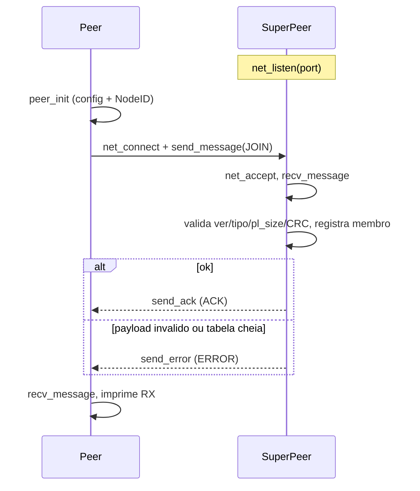

# Plano de implementação — Checkpoint 1 (Aluno 1)

Prazo: **18/09/2026**. Papel: Aluno 1. Fonte: [`docs/specification/trabalho_2026_SD.pdf`](../../specification/trabalho_2026_SD.pdf) (seção 6, Checkpoint 1).

Este documento descreve **como** o Aluno 1 implementa a sua parte do núcleo de rede — os arquivos que o PDF lhe atribui: `network.c`, `protocol.c` e `peer.c`. Complementa o plano do Aluno 2 ([`aluno-2.md`](aluno-2.md)), que cobre `node.c` e `superpeer.c`. Não substitui o relatório final do checkpoint (`deliverable/`).

## Objetivo

Entregar a camada de transporte e o formato de mensagens sobre os quais o resto do sistema conversa: abrir sockets TCP, enviar/receber bytes de forma confiável, e definir um **header padrão**, o **framing** de mensagem completa (header + payload), a **serialização** dos payloads de controle e o **checksum** (CRC32). Além disso, um processo `peer` cliente que se conecta a um Super Peer, envia uma mensagem de controle (`PING`/`JOIN`/`LEAVE`) e lê a resposta.

Ao final, o grupo demonstra dois processos conversando por TCP, header interpretado, checksum validado e nenhum segmentation fault (itens de verificação do CP1).

## Escopo

O PDF atribui ao Aluno 1 `network.c`, `protocol.c` e `peer.c`, que juntos devem realizar: criação do socket, `bind`, `listen`, `accept`, `connect`, `send`, `recv`, framing, header e checksum.

- **`network.c`** — sockets e I/O de stream (`socket`/`bind`/`listen`/`accept`/`connect`/`send`/`recv`), com `send_all`/`recv_all` garantindo transferência completa.
- **`protocol.c`** — header no fio, enum de tipos de mensagem, serialização (pack/unpack) dos payloads, CRC32, e framing de mensagem completa (`send_message`/`recv_message`).
- **`peer.c`** — processo cliente CLI que consome as duas APIs acima para falar com um Super Peer.

O `NodeID`, a configuração e o Super Peer em si são do Aluno 2; o `peer` **consome** essas APIs (`node.h`, `config.h`), não as reimplementa.

### Fora de escopo neste checkpoint

- Chord (`successor`, `predecessor`, finger table, `lookup`, `stabilize`, `notify`, `fix_fingers`).
- Gossip, heartbeat periódico e transições `SUSPECT`/`FAILED`/`REMOVED`.
- Bully, SMR, 2PC, IST.
- metadata, hash table, `ObjectID`, chunks.
- upload/download real, LZ4, LFU (os tipos `DOWNLOAD_REQ`/`DOWNLOAD_REP`, `GOSSIP`, `SNAPSHOT`, `STATE_TRANSFER` já aparecem no enum, mas seus handlers e o framing de payload variável ficam para os próximos checkpoints).

## Arquivos do Aluno 1

| Papel | Header | Fonte |
| --- | --- | --- |
| Sockets / I/O de stream | `include/common/network.h` | `src/common/network.c` |
| Header, framing, payloads, CRC32 | `include/common/protocol.h` | `src/common/protocol.c` |
| Cliente P2P | — | `src/peer/peer.c` |

`network` e `protocol` ficam em `common` porque `peer` e `superpeer` dependem dos dois. O `peer` ainda não tem header próprio (`include/peer/`); o `main` vive em `peer.c`.

## Design

### Camada de rede (`network.c` / `network.h`)

API mínima de sockets IPv4/TCP. Nenhuma outra parte do sistema chama `socket`/`bind`/`listen`/`accept`/`connect`/`send`/`recv` diretamente.

| Função | Papel |
| --- | --- |
| `net_listen(uint16_t port)` | Abre TCP IPv4 em `INADDR_ANY`, `SO_REUSEADDR`, backlog 128. Retorna fd ou `-1`. |
| `net_connect(const char* host_addr, uint16_t port)` | Cliente IPv4 (`inet_pton`). Usado pelo `peer` e por Super Peers falando entre si. |
| `net_accept(int listen_fd, struct sockaddr_in* out_addr)` | Aceita conexão e devolve o endereço do remoto em `out_addr`. |
| `net_close(int fd)` | Fecha o fd. |
| `send_all(int fd, const char* buffer, uint32_t buf_size)` | Envia o buffer inteiro em laço até `buf_size` bytes. `NET_OK` / `NET_ERROR`. |
| `recv_all(int fd, char* buffer, uint32_t buf_size)` | Recebe exatamente `buf_size` bytes. `NET_OK` / `NET_ERROR` / `NET_CLOSED`. |

Códigos de retorno em `network.h`: `NET_OK` (0), `NET_ERROR` (-1), `NET_CLOSED` (1).

Decisões:

- O `bind` escuta em todas as interfaces (`INADDR_ANY`), ignorando o `ip` do `.conf`. No CP1 (localhost/LAN) isso é adequado; o IP da config segue sendo usado para gerar o `NodeID` e anunciar o endereço.
- `send_all`/`recv_all` são I/O de **stream**, não framing: quem chama precisa saber quantos bytes ler. O framing propriamente dito vive em `protocol.c` (primeiro o header de tamanho fixo, depois `pl_size` bytes de payload).
- `recv_all` distingue conexão fechada (`recv` retorna 0 → `NET_CLOSED`) de erro (`< 0` → `NET_ERROR`), para o chamador tratar desconexão sem crash.

### Header padrão (`protocol.c` / `protocol.h`)

Todo tráfego começa com um header de tamanho fixo `HEADER_SIZE = 99` bytes. Campos multibyte vão em **big-endian** (network byte order). Serialização explícita via `pack_header`/`unpack_header` — nunca `send_all` do struct cru, para não vazar padding nem endianness do host.

| Offset | Tamanho | Campo | Notas |
| --- | --- | --- | --- |
| 0 | 1 | `protocol_ver` | `PROTOCOL_VER = 1`. Recusado no `recv` se divergir. |
| 1 | 2 | `msg_type` | `uint16_t` big-endian (enum abaixo). |
| 3 | 32 | `src_node` | `NodeID` da origem (SHA-256, 32 bytes crus). |
| 35 | 32 | `dst_node` | `NodeID` do destino. |
| 67 | 16 | `trsc_id` | `TransactionID` de 128 bits. |
| 83 | 8 | `time` | `uint64_t` big-endian (via `my_ntohll`). |
| 91 | 4 | `pl_size` | `uint32_t` big-endian: bytes de payload após o header. |
| 95 | 4 | `checksum` | `uint32_t` big-endian: CRC32 **do payload**. |

Total: 1 + 2 + 32 + 32 + 16 + 8 + 4 + 4 = **99 bytes**.

### Tipos de mensagem

`enum message_type` já contempla os tipos de todos os checkpoints; o CP1 exercita apenas o subconjunto de controle. Ordem atual: `JOIN`(0), `PING`(1), `PONG`(2), `LEAVE`(3), `LOOKUP`, `STORE`, `DOWNLOAD_REQ`, `DOWNLOAD_REP`, `PREPARE`, `COMMIT`, `ABORT`, `HEARTBEAT`, `GOSSIP`, `ELECTION`, `OK`, `COORDINATOR`, `SNAPSHOT`, `STATE_TRANSFER`, `ACK`, `ERROR`, `MSG_TYPE_MAX` (sentinela).

`payload_size_for(type)` devolve o tamanho fixo do payload de cada tipo de controle (ou `-1` para tipo fora de faixa); `message_type_name(type)` devolve o nome para log.

### Payloads de controle

Layout fixo no fio, sem padding entre campos. `protocol.h` declara os structs; `protocol.c` faz o pack/unpack de cada um.

**`JOIN`** — `pl_size = 39`

| Offset | Tamanho | Campo | Notas |
| --- | --- | --- | --- |
| 0 | 32 | `node_id` | `NodeID` do joiner; deve bater com `src_node` do header. |
| 32 | 4 | `ipv4` | Endereço anunciado, em network byte order (copiado como veio da config). |
| 36 | 2 | `port` | Porta anunciada, `uint16_t` big-endian (`htons`/`ntohs`). |
| 38 | 1 | `node_type` | `0` = `peer`, `1` = `superpeer`. |

**`ACK`** — `pl_size = 32`: 32 bytes com o `node_id` confirmado (o do joiner).

**`ERROR`** — `pl_size = 68`

| Offset | Tamanho | Campo | Notas |
| --- | --- | --- | --- |
| 0 | 4 | `code` | `uint32_t` big-endian. CP1: `1` malformado, `2` tabela cheia, `3` não suportado, `4` tipo inválido. |
| 4 | 64 | `reason` | UTF-8, NUL-padded. |

**`LEAVE`** — `pl_size = 32`: 32 bytes com o `node_id` de quem sai.

**`PING` / `PONG`** — `pl_size = 0`: sem payload; servem de sonda de conectividade/round-trip.

### Checksum (CRC32)

CRC32 via `zlib` (`crc32`), calculado **sobre o payload** (não sobre o header). No envio, `send_message` preenche `header.checksum` com o CRC do payload antes de serializar o header. Na recepção, `recv_message` recomputa o CRC dos `pl_size` bytes lidos e, se divergir de `checksum`, retorna `NET_ERROR` sem entregar a mensagem como válida. Para `PING`/`PONG` (payload vazio) o CRC é o valor inicial (`crc32(0, Z_NULL, 0)`), consistente nos dois lados.

### Framing de mensagem completa

- `send_message(fd, out_msg_buffer, msg_payload, msg_header)` — valida o tipo e o tamanho, empacota o payload logo após o header no buffer, calcula o CRC, serializa o header com `pack_header` e faz um único `send_all` de `HEADER_SIZE + pl_size`.
- `recv_message(fd, in_msg_buffer, struct_payload)` — `recv_all` do header, `unpack_header`, valida `protocol_ver` e `msg_type`, confere `pl_size` contra o esperado, `recv_all` do payload, valida o CRC e faz `unpack` para o struct correspondente. Retorna um `msg_t` (`{header, payload, status}`).
- `simple_send` / `simple_recv` — variantes para transportar um payload de string arbitrária (com o mesmo header + CRC), usadas em teste/comunicação simples de texto.
- Helpers de resposta: `fill_reply_header` (ecoa `trsc_id`, troca `src`/`dst`), e os atalhos `send_ack`, `send_error`, `send_join`, `send_leave`.

### Cliente P2P (`peer.c`)

Processo CLI que valida a ponta cliente do protocolo:

```sh
./peer --cmd <ping|join|leave> --host <ip> --port <porta>
```

- `peer_init` carrega `config/peer.conf` (via `node_config_load`, do Aluno 2), gera o `NodeID` (`node_id_generate`) a partir de IP, porta e um UUID aleatório, e preenche o `peer_t`.
- Mapeia o comando (`cmd_to_type`) para um `msg_type`, conecta com `net_connect`, monta o header (`protocol_ver`, `msg_type`, `src_node`, `time`, `pl_size`) e o payload do comando, e envia com `send_message`.
- Lê a resposta com `recv_message`, imprime `TX`/`RX` do tipo e fecha o socket.

## Fluxo (JOIN cliente → Super Peer)



## Integração com o Aluno 2

- O Aluno 2 (`superpeer.c`) consome `net_listen`/`net_accept`/`net_close` e `recv_message`/`send_ack`/`send_error` — não abre sockets nem monta o protocolo na mão.
- O contrato de header (tipos de `NodeID`/`TransactionID`, enum, `pl_size` por tipo) e os layouts de `JOIN`/`ACK`/`ERROR`/`LEAVE` são definidos aqui, em `protocol.h`, e usados pelo Super Peer sem cópia de struct.
- O `peer` depende de `node.h`/`config.h` do Aluno 2 para `NodeID` e configuração — o único acoplamento na direção inversa.

## Testes / itens de verificação (CP1)

1. **Conexão TCP funcionando** — `peer` conecta ao `superpeer` por `net_connect`/`net_accept`.
2. **Mensagem chega corretamente** — `JOIN` enviado é recebido e desserializado igual ao original.
3. **Header interpretado** — `unpack_header` reconstrói `msg_type`, `pl_size`, `src_node`, `trsc_id`, `time`.
4. **Checksum validado** — CRC correto entrega a mensagem; CRC adulterado faz `recv_message` retornar `NET_ERROR` sem registrar nada.
5. **Dois processos conversam** — `peer --cmd join` recebe `ACK`; `peer --cmd ping` recebe resposta.
6. **Sem segmentation fault** — payload malformado, tipo não suportado, tabela cheia e desconexão (`NET_CLOSED`) são tratados; o processo segue.

## Pontos de atenção / dívida técnica

- Há marcadores `// TEMP` (nomes de tipo/`message_type_name`) e um `//TODO` no comentário do `pl_header` de checkpoints anteriores; os tipos do header já foram fixados, mas o comentário permanece.
- O framing de payload **variável** (para `DOWNLOAD_REP`, `GOSSIP`, `SNAPSHOT`, `STATE_TRANSFER`) ainda não está implementado — `recv_message` os exclui da validação de tamanho fixo, mas não os monta. Fica para o CP2+.
- `simple_send`/`simple_recv` reusam mensagens de erro genéricas (`"recv_message # corrupted header"`) mesmo no caminho de envio; melhorar o logging quando houver mais códigos de status é desejável (há `TODO` no código).
- O `peer` ainda lê um caminho de config fixo (`config/peer.conf`) em `peer_init`, independente dos argumentos CLI de `host`/`port`; alinhar isso com a config é um refino futuro.

> Observação: as sugestões acima são apenas anotações de documentação. Qualquer mudança em `src/` deve ser pedida explicitamente — este plano não altera código.
