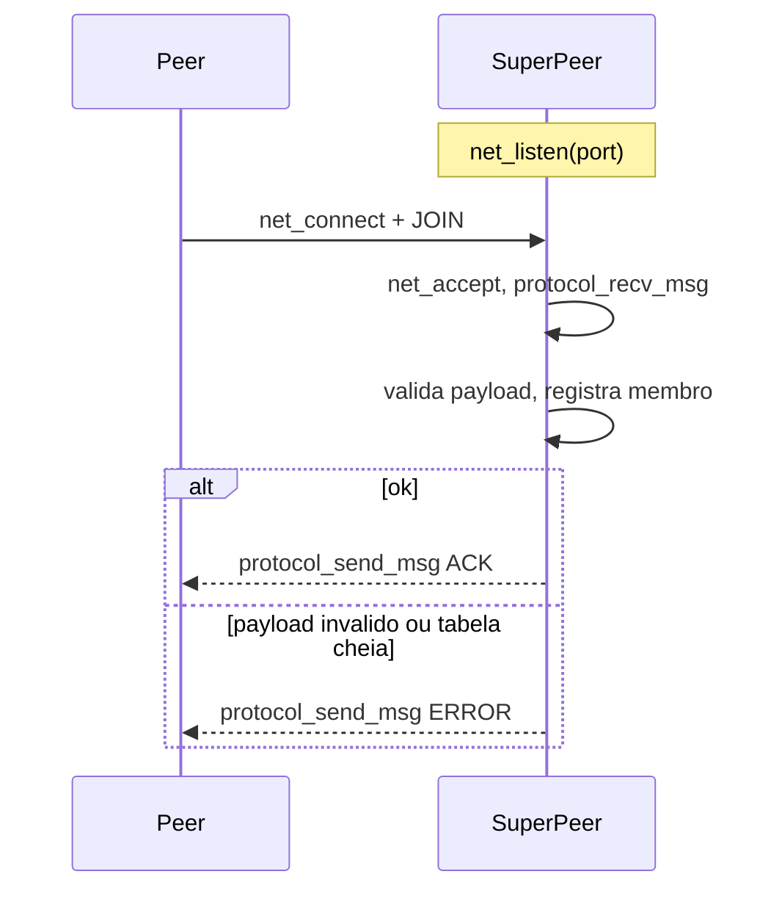

# Plano de implementação — Checkpoint 1 (Aluno 2)

Prazo: **18/09/2026**. Papel: Aluno 2. Fonte: [`docs/specification/trabalho_2026_SD.pdf`](../../specification/trabalho_2026_SD.pdf) (seção 6, Checkpoint 1).

Este documento descreve **como** o Aluno 2 implementa a sua parte do núcleo de rede, alinhado ao que já existe em `src/common/network.c` e `src/common/protocol.c`. Não substitui o relatório final do checkpoint (`deliverable/`).

## Objetivo

Deixar um processo `superpeer` identificável, configurável e capaz de registrar nós numa tabela de membros ao receber `JOIN`, respondendo `ACK` ou `ERROR`. Sockets e I/O bruto vêm de `network.c`; header, framing de mensagem, checksum e tipos ficam em `protocol.c`.

Ao final, o grupo demonstra dois processos conversando por TCP, header interpretado, checksum validado e nenhum segmentation fault.

## Escopo

O PDF atribui ao Aluno 2 `node.c` e `superpeer.c`:

- geração, comparação, serialização e impressão de `NodeID`
- carregamento de configuração
- identificação do processo (imprimir papel, endereço e `NodeID` na inicialização)
- criação do Super Peer (listen + loop de mensagens **usando** a API de `network.c`)
- registro de nó
- tabela básica de membros

O Aluno 2 **não** reimplementa `socket`/`bind`/`listen`/`accept`/`connect`/`send`/`recv`. Consome `net_listen`, `net_connect`, `net_accept`, `net_close`, `send_all` e `recv_all`.

### Fora de escopo neste checkpoint

- Chord (`successor`, `predecessor`, finger table, `lookup`, `join` Chord, `stabilize`, `notify`, `fix_fingers`)
- Gossip, heartbeat periódico e transições `SUSPECT`/`FAILED`/`REMOVED`
- Bully, SMR, 2PC, IST
- metadata, hash table, `ObjectID`, chunks
- upload/download, LZ4, LFU

## Estado atual da API do Aluno 1

Não existem ainda `include/common/network.h` nem `include/common/protocol.h`. As funções e o struct estão só nos `.c`. O Super Peer não consegue incluir essa API de forma limpa até os headers existirem.

### `src/common/network.c` — utilizável no CP1

| Função | Papel para o Super Peer |
| --- | --- |
| `net_listen(uint16_t port)` | Abre TCP IPv4 em `INADDR_ANY`, `SO_REUSEADDR`, backlog 128. Retorna fd ou `-1`. |
| `net_connect(char *host_addr, uint16_t port)` | Cliente IPv4 (`inet_pton`). Serve para Peer ou para um Super Peer falando com outro. |
| `net_accept(int listen_fd, struct sockaddr_in *out_addr)` | Aceita conexão e devolve o endereço do remoto. |
| `net_close(int fd)` | Fecha o fd. |
| `send_all(int fd, const char *buffer, uint32_t buf_size)` | Envia o buffer inteiro. `NET_OK` / `NET_ERROR`. |
| `recv_all(int fd, char *buffer, uint32_t buf_size)` | Recebe exatamente `buf_size` bytes. `NET_OK` / `NET_ERROR` / `NET_CLOSED`. |

O bind ignora o `ip` do `.conf` e escuta em todas as interfaces. No CP1 isso é adequado (localhost/LAN). O IP da config continua sendo usado para gerar o `NodeID` e para anunciar o endereço aos outros nós.

`send_all` / `recv_all` são I/O de stream, **não** framing de mensagem. Quem chama precisa saber o tamanho (primeiro o header de tamanho fixo, depois `pl_size` bytes de payload). Não há `send_msg` / `recv_msg`.

`pthread.h` está incluído, mas não há thread por conexão. A spec do CP1 pede concorrência básica: o Super Peer pode fazer `pthread_create` depois de `net_accept`, sem abrir sockets por conta própria.

### `src/common/protocol.c` — rascunho, ainda não dá para integrar

Há apenas o struct `pl_header` (`payloadHeader`) com um `TODO` de tipos. Campos atuais: `protocol_ver`, `msg_type`, `src_node`, `dst_node`, `trsc_id`, `time`, `pl_size`, `checksun` — todos `uint32_t`.

Falta: enum de tipos de mensagem, serialização (endianness / packing), CRC32, `recv` de header+payload, payloads de `JOIN`/`ACK`/`ERROR`.

## Mudanças necessárias em `network.c` e `protocol.c`

O Aluno 2 **não** edita esses arquivos; pede o seguinte ao Aluno 1 (apoio na revisão). Sem isso, o handler de `JOIN` não fecha.

### Obrigatório em `protocol.c` (e `include/common/protocol.h`)

1. **Header público.** Mover `pl_header` para `include/common/protocol.h`. O Super Peer não deve copiar o struct.

2. **Tipos alinhados à spec.** `src_node` / `dst_node` como `uint32_t` **não cabem** o `NodeID` (`SHA256` → 32 bytes). `trsc_id` como `uint32_t` não cabe o `TransactionID` de 128 bits. Pedido:

   | Campo da spec | Tipo no fio |
   | --- | --- |
   | Protocol Version | `uint32_t` |
   | Message Type | `uint32_t` (enum abaixo) |
   | Source Node | `uint8_t[32]` (`NodeID`) |
   | Destination Node | `uint8_t[32]` (`NodeID`) |
   | Transaction ID | `uint8_t[16]` |
   | Timestamp | `uint64_t` ou `uint32_t` (fixar um; a spec não detalha largura) |
   | Payload Size | `uint32_t` |
   | Checksum | `uint32_t` CRC32 — corrigir o nome `checksun` → `checksum` |

3. **Enum de `msg_type` desde o CP1:** `JOIN`, `LEAVE`, `LOOKUP`, `STORE`, `DOWNLOAD_REQ`, `DOWNLOAD_REP`, `PREPARE`, `COMMIT`, `ABORT`, `HEARTBEAT`, `GOSSIP`, `ELECTION`, `OK`, `COORDINATOR`, `SNAPSHOT`, `STATE_TRANSFER`, `ACK`, `ERROR`.

4. **Serialização explícita.** Não dar `send_all` no struct em memória (padding e endianness do host). Funções do tipo `protocol_header_encode` / `protocol_header_decode` com tamanho fixo no fio e ordem de bytes definida (big-endian).

5. **CRC32.** Calcular/verificar o checksum da mensagem (header com campo checksum zerado + payload, ou o combinado que o Aluno 1 documentar). `recv` de mensagem **não** deve devolver sucesso se o CRC falhar.

6. **Framing de mensagem completa** (pode viver em `protocol.c` chamando `send_all`/`recv_all`):
   - `protocol_recv_msg(fd, header, payload, payload_cap)` — `recv_all` do header, checar CRC e `pl_size`, `recv_all` do payload; recusar `pl_size` maior que o cap.
   - `protocol_send_msg(fd, header, payload)` — preenche `pl_size` e CRC, envia header+payload.

   Sem isso, o Super Peer teria que reimplementar framing; isso foge do papel do Aluno 2.

7. **Payloads de CP1** — layout fixo no fio (big-endian, sem padding entre campos). O Super Peer só preenche/lê; `protocol.h` declara os structs e o tamanho de cada payload (`pl_size` obrigatório).

   O joiner calcula `NodeID = SHA256(IP || Porta || UUID)` e manda esse valor. O Super Peer **não** gera outro ID. O `ACK` ecoa o `NodeID` gravado para cumprir o UC-01 (“nó recebe NodeID”) como confirmação, não como atribuição. O peer compara o eco com o ID que já tinha.

   **`JOIN`** — `pl_size = 39`

   | Offset | Tamanho | Campo | Notas |
   | --- | --- | --- | --- |
   | 0 | 32 | `node_id` | Mesmo valor que `src_node` no header. Super Peer rejeita se divergir. |
   | 32 | 4 | `ipv4` | Endereço anunciado (`chave=valor` `ip`), `uint32_t` big-endian. Não precisa ser o IP do `accept`. |
   | 36 | 2 | `port` | Porta anunciada, `uint16_t` big-endian. |
   | 38 | 1 | `node_type` | `0` = `peer`, `1` = `superpeer`. Classifica o membro (cliente vs overlay). Outro valor → `ERROR`. |

   **`ACK`** — `pl_size = 32`

   | Offset | Tamanho | Campo | Notas |
   | --- | --- | --- | --- |
   | 0 | 32 | `node_id` | Cópia do `NodeID` inserido na tabela (o do joiner). |

   O `ACK` responde ao mesmo `TransactionID` do `JOIN`. `src_node` = Super Peer; `dst_node` = joiner.

   **`ERROR`** — `pl_size = 68`

   | Offset | Tamanho | Campo | Notas |
   | --- | --- | --- | --- |
   | 0 | 4 | `code` | `uint32_t` big-endian. CP1: `1` payload malformado, `2` tabela cheia, `3` `msg_type` não suportado, `4` `node_type` inválido. |
   | 4 | 64 | `reason` | UTF-8, NUL-padded, sem exigir terminador se os 64 bytes estiverem cheios. |

   `ERROR` também ecoa o `TransactionID` da mensagem rejeitada, quando houver.

### Obrigatório em `network.c` (e `include/common/network.h`)

1. **Header público** com os protótipos atuais (`net_listen`, `net_connect`, `net_accept`, `net_close`, `send_all`, `recv_all`) e os códigos `NET_OK`, `NET_ERROR`, `NET_CLOSED`.
2. **Não** é obrigatório mudar o bind para o IP do `.conf` no CP1.
3. Opcional: `send_all`/`recv_all` com `void *` em vez de `char *` (header binário). Cosmético se o Super Peer fizer cast.
4. Opcional: helper de thread por conexão. Se não vier, o Super Peer usa `pthread_create` em cima de `net_accept`.

### O que o Aluno 2 faz se o protocolo atrasar

Implementar e testar `NodeID`, config e tabela de membros **sem socket** (chamadas diretas). Não copiar `pl_header` para dentro de `superpeer.c`. A integração TCP espera o header público e `protocol_send_msg` / `protocol_recv_msg`.

## Arquivos do Aluno 2

| Papel | Header | Fonte |
| --- | --- | --- |
| Identidade e config | `include/common/node.h` | `src/common/node.c` |
| Super Peer | `include/superpeer/superpeer.h` | `src/superpeer/superpeer.c` |

`node` fica em `common` porque `peer` e `superpeer` precisam de `NodeID`. Config: `config/` (ex.: `config/sp1.conf`). Este plano não cria os `.conf`.

## Design do Aluno 2

### `NodeID`

Fórmula da spec: `NodeID = SHA256(IP || Porta || UUID)`.

- Representação: `uint8_t id[32]`.
- Comparação: lexicográfica byte a byte (base para Chord no CP3).
- Impressão: 64 caracteres hexadecimais.
- No fio: os 32 bytes crus no header (`src_node` / `dst_node`) e no payload de `JOIN`/`ACK`, **não** string hex.

**UUID:** 16 bytes de `/dev/urandom` no start, sem `libuuid`. Concatenar IP, porta e UUID de forma estável (comprimentos fixos ou prefixados) antes do hash.

**SHA-256:** wrapper mínimo `sha256(input, len, out[32])` via OpenSSL (`libcrypto`) ou rotina em `third_party/`, combinado com o Aluno 1 (ele usa o mesmo wrapper no pipeline de arquivos no CP2). Não implementar SHA-256 à mão em `node.c`.

**Estabilidade:** UUID novo a cada start implica `NodeID` novo. No CP1 isso serve ao teste de IDs distintos. Persistência do UUID fica para depois, se o grupo quiser identidade estável.

O rascunho atual de `protocol.c` **quebra** este design enquanto `src_node` for `uint32_t`. Por isso a mudança de tipo no header é obrigatória, não um detalhe estético.

### Configuração

Formato `chave=valor` em `config/`:

- `ip` — endereço anunciado / usado no `NodeID` (não é o bind atual de `net_listen`)
- `port` — passado a `net_listen`
- `type` — `superpeer`
- `bootstrap` — `ip:port` de Super Peers iniciais (vazio no primeiro nó)

CLI: `./superpeer config/sp1.conf`.

### Identificação do processo

No start, stdout: tipo, IP, porta, `NodeID` em hex. Dois Super Peers em portas diferentes → `NodeID` diferentes.

### Tabela de membros

Campos da spec: `NodeID`, IP, porta, estado, `LastHeartbeat`, `Version`.

- Enum: `ALIVE`, `SUSPECT`, `FAILED`, `REMOVED`. No CP1 só `ALIVE`.
- Capacidade 64. Sem persistência.
- Inserir no `JOIN`, buscar por `NodeID` e por IP+porta, imprimir a tabela.
- `JOIN` repetido do mesmo IP+porta: atualizar, não duplicar.
- Tabela cheia: `ERROR`, sem estourar buffer.

### Processo Super Peer e `JOIN`

Ciclo de vida:

1. Carregar `.conf`, gerar UUID e `NodeID`, imprimir identidade.
2. Incluir o próprio Super Peer na tabela como `ALIVE`.
3. `listen_fd = net_listen(port)`.
4. Loop: `net_accept` → (opcional) thread → `protocol_recv_msg`.
5. `JOIN` válido: registrar, `ACK` com o `NodeID` do joiner. Payload inválido ou tabela cheia: `ERROR`, processo segue.
6. Outros `msg_type`: ignorar ou `ERROR` “não suportado”.
7. CRC inválido ou `NET_CLOSED`: não registrar membro; fechar o fd com `net_close`. Sem segfault.

IP/porta do membro: preferir o payload de `JOIN`; `out_addr` de `net_accept` é fallback se o contrato ainda não trouxer IP.

## Ordem de trabalho

1. **Pedir ao Aluno 1** os itens obrigatórios da seção de mudanças (`protocol.h`, tipos de `NodeID`/`TransactionID`, enum, encode/decode, CRC32, `protocol_send_msg`/`protocol_recv_msg`, payloads JOIN/ACK/ERROR, `network.h`).
2. **`node.h` / `node.c`** — `NodeID`, config, gerar/comparar/serializar/imprimir.
3. **Wrapper SHA-256** — um símbolo só, compartilhado com o Aluno 1.
4. **Membership em `superpeer`** — tabela fixa; testável sem socket.
5. **Handler de `JOIN`** — preenche/lê os payloads do protocolo; chama `protocol_send_msg`/`protocol_recv_msg`.
6. **Integração** — `main`: config + `NodeID` + `net_listen` + loop `net_accept`. Zero `socket()` próprio.
7. **Testes manuais** da seção seguinte.

## Testes

1. **JOIN feliz** — Super Peer + Peer: `JOIN` entra na tabela, `ACK` volta, tabela impressa.
2. **Identidades distintas** — dois Super Peers em portas diferentes, `NodeID` diferentes.
3. **Payload inválido** — `JOIN` malformado → `ERROR`, sem crash.
4. **Checksum** — CRC errado: `protocol_recv_msg` falha, membro não entra, sem crash.
5. **Peer desconecta** — `recv_all` devolve `NET_CLOSED`; Super Peer fecha o fd e segue aceitando.
6. **Reinício** — mesmo `.conf`, bind reproduzível. `NodeID` pode mudar (UUID novo); dizer isso na demo.

## Riscos

- **Header com `NodeID` de 4 bytes** — bloqueia identidade da spec. Mitigação: mudança obrigatória em `protocol.c` antes da integração.
- **Framing só com `send_all`/`recv_all`** — tentação de o Super Peer montar o protocolo na mão. Mitigação: esperar `protocol_send_msg`/`protocol_recv_msg`.
- **SHA-256 duplicado.** Mitigação: um wrapper.
- **Chord/Gossip cedo demais.** Mitigação: enum de estados e tipos existem; handlers extra ficam para os CP 3 e 4.
