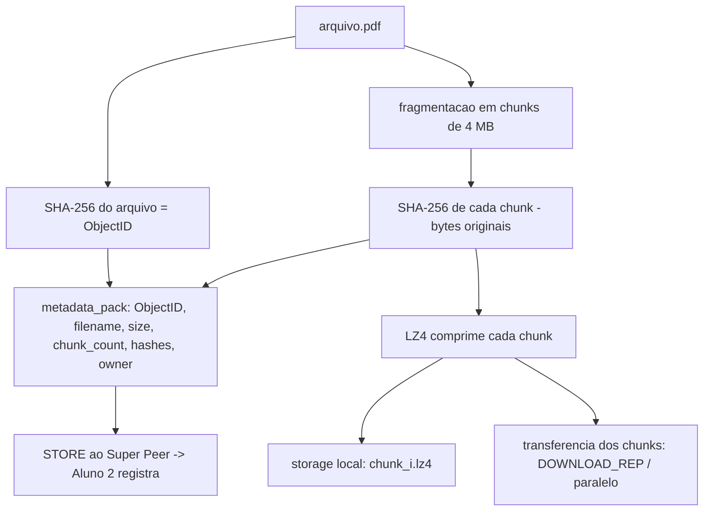
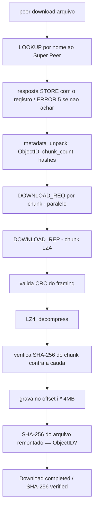

# Plano de implementação — Checkpoint 2 (Aluno 1)

Prazo: **30/09/2026**. Papel: Aluno 1. Fonte: [`docs/specification/trabalho_2026_SD.pdf`](../../specification/trabalho_2026_SD.pdf) (seção 7, Checkpoint 2).

Este documento descreve **como** o Aluno 1 implementa a sua parte do CP2: o pipeline de arquivos do lado do cliente (`peer`). Complementa a parte do Aluno 2 (metadata, hash table, `ObjectID`, registro de chunks), descrita em [`aluno-2.md`](aluno-2.md). Os pontos de contato entre as duas pontas estão fixados em [`contrato-aluno-1-aluno-2.md`](contrato-aluno-1-aluno-2.md) — este plano segue esse contrato. Reaproveita o núcleo de rede/protocolo do CP1. Não substitui o relatório final (`deliverable/`).

## Objetivo

Fazer o `peer` **publicar** e **baixar** um documento PDF de ponta a ponta, executando o pipeline da spec:

```
arquivo → SHA-256 → fragmentação (chunking) → LZ4 → checksum → transferência
```

e o caminho inverso no download (recepção → checksum → LZ4 decode → SHA-256 → validação → entrega).

Ao final, os itens de verificação do CP2 devem funcionar:

```
./peer upload arquivo.pdf
File: arquivo.pdf
Size: 12458291 bytes
ObjectID: a7f3...
Chunks: 3
Chunk 0: ...
Chunk 1: ...
Chunk 2: ...
Compression: LZ4

./peer download arquivo.pdf
Download completed
SHA-256 verified
```

## Escopo

O PDF atribui ao Aluno 1: **upload, download, storage, chunking, SHA-256, LZ4, transferência paralela**.

- **SHA-256 do arquivo** → gera o `ObjectID` (32 bytes), reusando o wrapper `sha256()` de `include/common/node.h` (o mesmo do Aluno 2; ninguém adiciona uma segunda dependência de cripto — contrato C1).
- **Chunking** — fragmentar o arquivo em blocos de tamanho fixo (**4 MB**, ver decisões); cada chunk tem seu próprio SHA-256.
- **LZ4** — comprimir cada chunk antes de enviar; descomprimir na recepção.
- **Checksum** — o CRC32 do framing (CP1) protege cada mensagem no fio; o SHA-256 por chunk e do arquivo garante integridade de conteúdo.
- **Storage** — armazenamento local dos chunks/arquivo, nas duas pontas.
- **Transferência** — envio/recepção dos chunks via `DOWNLOAD_REQ`/`DOWNLOAD_REP`; **paralela** numa segunda etapa (threads).

### Fora de escopo do Aluno 1 neste checkpoint

- `metadata`, `hash table`, `ObjectID` como chave de registro, e o **registro dos chunks** no índice — do Aluno 2. O Aluno 1 **produz** o `ObjectID` e a lista de hashes; o Aluno 2 os **armazena/indexa** (via `STORE`).
- Chord/`lookup` distribuído real (CP3): no CP2 o `LOOKUP` é resolvido direto no Super Peer.
- Replicação, LFU, 2PC, IST. Campos de metadado além dos sete de verificação (`Compression`, `ReplicaPeers`, `UploadDate`, etc.) ficam fora do CP2 (contrato C10).

## O que já existe (base a reusar)

Do **CP1** (rede/protocolo):

- Framing/transporte: `serialize_message`/`deserialize_message`, `send_message`/`recv_message`, `send_all`/`recv_all`, header de 99 bytes com CRC32 do payload (`include/common/protocol.h`, `include/common/network.h`).
- Tipos no enum: `STORE`, `LOOKUP`, `DOWNLOAD_REQ`, `DOWNLOAD_REP`. Em `payload_sizes[]`, todos com `-1` (payload variável).
- `sha256()` em `include/common/node.h`.
- CLI do peer em `src/peer/peer.c` (`getopt`); hoje aceita `--cmd ping|join|leave`.

Do **CP2 já entregue pelo Aluno 2** (contrato de metadata):

- `file_metadata_t` e as constantes `METADATA_OBJECT_ID_SIZE` (32), `METADATA_FILENAME_MAX` (256), `METADATA_CHUNK_HASH_SIZE` (32), `METADATA_WIRE_PREFIX` (336), `METADATA_PAYLOAD_MAX` (64 KB) em `include/common/protocol.h`.
- `metadata_pack`/`metadata_unpack`/`metadata_wire_size`/`metadata_init`/`metadata_release` em `src/common/protocol.c`. **O Aluno 1 usa essas funções; não escreve um empacotador paralelo** (contrato C6).

## Decisões de projeto (fixadas pelo contrato)

1. **Chunk size = 4 MB** (a spec fixa). A constante pertence ao módulo de fragmentação do Aluno 1; o Super Peer é agnóstico a ela e **não** valida `chunk_count == ceil(size / CHUNK_SIZE)` (contrato C4).
2. **`ObjectID` = `SHA-256(conteúdo do arquivo original)`**, calculado no upload pelo Aluno 1, tratado como chave opaca pelo Super Peer (contrato C1).
3. **Hash de chunk sobre os bytes originais, ANTES do LZ4** (contrato C2 — "o item mais perigoso"). O receptor descomprime e só então compara o hash; LZ4 não garante saída byte-idêntica, então hash de dado comprimido nem é estável.
4. **`size` = tamanho do arquivo original, não comprimido** (contrato C3). Tamanho comprimido não entra no metadado no CP2.
5. **`owner` = `node_id_t` (32 bytes)** no fio, não `uint32_t` (contrato C10).
6. **Payload de `STORE`** = saída de `metadata_pack` (prefixo de 336 bytes + `chunk_count`×32 hashes), big-endian (contrato C6).
7. **Teto de payload de controle** = 4096 bytes → cabe até **117 chunks** (~468 MB com chunks de 4 MB). Nada a mexer no CP2 (contrato C7).
8. **Biblioteca LZ4.** Preferir `liblz4` do sistema (`-llz4`, `lz4.h`); alternativa em `third_party/`. Verificar disponibilidade antes de codar; não implementar LZ4 à mão.

## Ajustes necessários em `protocol.c` (arquivo do Aluno 1)

O contrato aponta duas coisas em `src/common/protocol.c`/`recv_message`:

1. **Aceitar `STORE`/`LOOKUP` no `deserialize_message`** (contrato C5). Como `payload_sizes[STORE] == -1`, o payload já é copiado para o buffer do chamador; só falta o `switch` não cair no `default`:

   ```c
   case STORE:
   case LOOKUP:
       break;   /* payload variável; o handler desserializa com metadata_unpack */
   ```

2. **Bug do ramo de payload variável, a corrigir antes do download** (contrato C5, "armadilha"). Hoje `recv_message` tem uma condição que dispensa `DOWNLOAD_REQ`, `DOWNLOAD_REP`, `GOSSIP`, `SNAPSHOT`, `STATE_TRANSFER` da validação de tamanho **e retorna o header sem ler o payload do socket**, deixando bytes na conexão e dessincronizando o stream. Isso atinge o Aluno 1 exatamente ao ligar `DOWNLOAD_REQ`/`DOWNLOAD_REP`. Precisa ser corrigido para que esses tipos leiam `pl_size` bytes do socket antes de retornar.

> Mudança de código exige pedido explícito; este documento só registra o que precisa mudar e por quê.

## Arquivos do Aluno 1 (proposta)

| Papel | Header | Fonte |
| --- | --- | --- |
| Fragmentação (hash do arquivo/chunk, chunking, remontagem) | `include/peer/file_pipeline.h` | `src/peer/file_pipeline.c` |
| Compressão LZ4 (wrapper) | `include/common/compression.h` | `src/common/compression.c` |
| Storage local de chunks | `include/peer/storage.h` | `src/peer/storage.c` |
| Transferência (upload/download, threads) | `include/peer/transfer.h` | `src/peer/transfer.c` |
| CLI | — | `src/peer/peer.c` (novos subcomandos) |
| Ajustes de framing | `include/common/protocol.h` | `src/common/protocol.c` (itens acima) |

Nomes indicativos; ajustar à organização atual de `src/`.

## Design

### Pipeline de upload



Etapas:

1. Ler o arquivo; `ObjectID = sha256(conteúdo)`; `size` = tamanho original.
2. Fragmentar em `chunk_count = ceil(size / 4MB)` blocos.
3. Para cada chunk: `sha256` do bloco **original** → cauda de hashes; `LZ4_compress` → storage.
4. Preencher `file_metadata_t` (`metadata_init` + campos + cauda de hashes contígua) e serializar com `metadata_pack`; enviar `STORE`.
5. Imprimir o relatório de verificação (File/Size/ObjectID/Chunks/Chunk i/Compression).

### Pipeline de download



Etapas:

1. `LOOKUP` do nome ao Super Peer (formato em C8): payload de 257 bytes — `key_kind` (1 byte; `0`=ObjectID, `1`=nome) + `key` (256, NUL-terminated). Acerto → resposta `STORE` com o registro; falha → `ERROR` código `5`.
2. `metadata_unpack` na resposta; para cada índice, `DOWNLOAD_REQ` (`ObjectID` + índice).
3. Ao receber `DOWNLOAD_REP`: CRC do framing → `LZ4_decompress` → conferir `sha256` do chunk contra o hash da cauda.
4. Gravar cada chunk no offset `i * CHUNK_SIZE` (ordem pelo índice, não pela chegada); ao final, `sha256` do arquivo inteiro == `ObjectID`.
5. Imprimir `Download completed` e `SHA-256 verified`. Distinguir `ERROR 5` (não encontrado) e `ERROR 6` (tabela cheia) dos códigos `1`–`4` do CP1 (contrato C9).

### Transferência paralela

- Primeiro uma versão **sequencial** correta (um chunk por vez) para validar o pipeline.
- Depois **paralelizar** com `pthreads`: pool de N threads baixando/enviando chunks independentes; a remontagem escreve no offset do índice. Sincronizar estado/fd compartilhado.
- Dependência: o bug de `recv_message` (payload variável) precisa estar corrigido antes de `DOWNLOAD_*`.

### Wrapper de compressão

`include/common/compression.h`:

- `int lz4_compress(const uint8_t *in, size_t in_len, uint8_t *out, size_t out_cap, size_t *out_len)`
- `int lz4_decompress(const uint8_t *in, size_t in_len, uint8_t *out, size_t out_cap, size_t *out_len)`

Símbolo único, isolando a dependência da lib (como `sha256()` faz com o OpenSSL).

## Integração com o Aluno 2 — checklist do contrato

Itens de [`contrato-aluno-1-aluno-2.md`](contrato-aluno-1-aluno-2.md) que dependem do Aluno 1:

- **C1** — o `upload` calcula o `ObjectID` e o envia no payload.
- **C2** — o hash de chunk é calculado antes do LZ4.
- **C3** — envia o tamanho original em `size`.
- **C4** — a constante de chunk (4 MB) vive no módulo de fragmentação.
- **C5** — os `case STORE`/`LOOKUP` entram em `deserialize_message`; ciência do bug do ramo de payload variável, a corrigir antes do download.
- **C6** — o peer monta o payload de `STORE` com `metadata_pack`.
- **C7** — ciência do teto de 117 chunks para o `STORE`.
- **C8** — o `download` envia `LOOKUP` no formato de 257 bytes.
- **C9** — o peer distingue os códigos `5`/`6` dos anteriores.
- **C10** — `owner` tem 32 bytes no fio.

## Ordem de trabalho

1. Wrapper LZ4 (`compression.c/.h`) + teste round-trip.
2. Fragmentação: SHA-256 do arquivo (ObjectID), chunking de 4 MB, SHA-256 por chunk.
3. Storage local dos chunks.
4. Ajustes em `protocol.c` (C5: `case STORE`/`LOOKUP`; correção do bug de payload variável).
5. Subcomando `upload`: pipeline + `metadata_pack` + `STORE` + relatório de verificação.
6. Subcomando `download`: `LOOKUP` + `DOWNLOAD_REQ`/`DOWNLOAD_REP` sequencial + descompressão + verificação.
7. Paralelizar a transferência com `pthreads`.
8. Testes ponta a ponta (upload → download → SHA-256 confere).

## Testes

1. **Round-trip LZ4** — comprimir/descomprimir devolve o original.
2. **Chunking** — arquivo de tamanho não múltiplo de 4 MB dá `chunk_count` correto e último chunk menor.
3. **ObjectID estável** — mesmo arquivo → mesmo `ObjectID`; alterado → diferente.
4. **`STORE` round-trip** — `metadata_pack` no peer → `metadata_unpack` no Super Peer reconstrói o registro (offsets/cauda).
5. **Upload** — `./peer upload arquivo.pdf` imprime File/Size/ObjectID/Chunks/Compression e registra.
6. **Download** — `./peer download arquivo.pdf` remonta e imprime `Download completed` / `SHA-256 verified`.
7. **Integridade sob corrupção** — chunk adulterado → CRC/SHA-256 detecta, download falha limpo (sem crash).
8. **Paralelo == sequencial** — arquivo remontado em paralelo idêntico ao sequencial.
9. **`LOOKUP` sem acerto** — retorna `ERROR 5`, tratado sem crash.

## Riscos

- **Hash de chunk após o LZ4 (violar C2)** → verificação falha em todo download, com sintoma longe da causa. Mitigação: hash sobre bytes originais; teste de round-trip cedo.
- **Bug do ramo de payload variável em `recv_message`** → stream dessincroniza ao ligar `DOWNLOAD_*`. Mitigação: corrigir antes de implementar o download (C5).
- **Empacotador de `STORE` paralelo ao `metadata_pack`** → divergência de layout com o Aluno 2. Mitigação: usar `metadata_pack`/`metadata_unpack`, nunca reescrever (C6).
- **Concorrência na remontagem** → corrupção por escrita fora de ordem. Mitigação: escrever por offset do índice; sincronizar estado compartilhado.
- **Disponibilidade da `liblz4`** → build quebra. Mitigação: checar a lib antes; fallback para `third_party/`.
