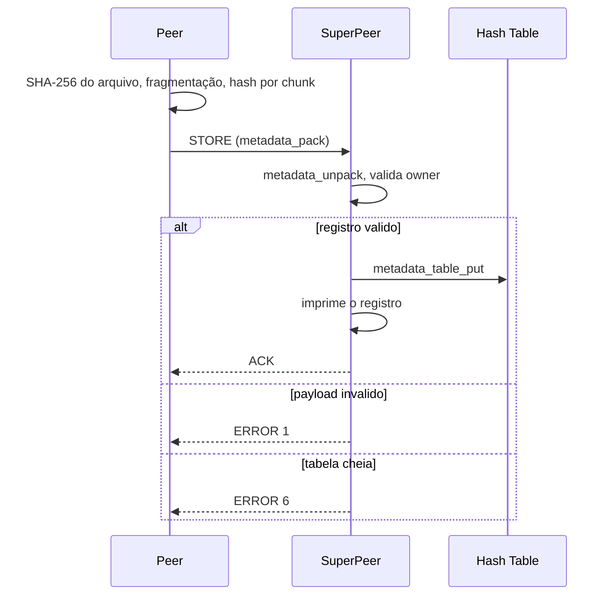

# Plano de implementação — Checkpoint 2 (Aluno 2)

Prazo: **30/09/2026**. Papel: Aluno 2. Fonte: [`docs/specification/trabalho_2026_SD.pdf`](../../specification/trabalho_2026_SD.pdf) (seção 7, Checkpoint 2).

Este documento descreve **como** o Aluno 2 implementa a sua parte do CP2. Os
pontos de interface com o pipeline de arquivos do Aluno 1 ficam num documento
separado: [`contrato-aluno-1-aluno-2.md`](contrato-aluno-1-aluno-2.md). As
referências a itens `C1`–`C10` ao longo deste plano apontam para lá.

Não substitui o relatório final do checkpoint (`deliverable/`).

## Objetivo

Deixar o Super Peer capaz de receber o registro de metadata de um arquivo
publicado, guardá-lo numa hash table indexada por ObjectID, e devolvê-lo quando
consultado por ObjectID ou por nome. O arquivo em si nunca passa pelo Super
Peer: o banco de metadados guarda apenas informação descritiva e a localização
lógica do recurso.

## Escopo

O PDF atribui ao Aluno 2, no CP2:

- metadata
- hash table
- ObjectID
- registro dos chunks

### Fora de escopo neste checkpoint

Do Aluno 1: upload, download, storage, chunking, SHA-256 de arquivo, LZ4 e
transferência paralela.

Dos checkpoints seguintes: Chord, Gossip, heartbeat, Bully, SMR, 2PC, IST e LFU.
Isso inclui os campos `version` e `last_heartbeat` e os estados `SUSPECT` /
`FAILED` da tabela de membros, que continuam sem leitor — existem para o CP3 e
não devem ganhar lógica agora.

Também fora de escopo os campos da tabela "Estrutura da Entrada de Metadados" do
documento de arquitetura que não estão no struct de verificação do CP2
(`Compression`, `ReplicaPeers`, `UploadDate`, `LastAccess`, `DownloadCounter`,
`Status`) — ver `C10`.

## Estado atual

O que já existe:

- O registro e o layout no fio estão declarados em `include/common/protocol.h`:
  `file_metadata_t`, as constantes de layout e
  `metadata_pack`/`metadata_unpack`. A hash table está declarada em
  `include/superpeer/metadata.h`: `metadata_table_t` e as funções
  `metadata_table_*`.
- O Super Peer em `src/superpeer/superpeer.c` e
  `include/superpeer/superpeer.h` já tem identidade, configuração, tabela de
  membros, `JOIN`/`LEAVE`/`PING` e thread por conexão, entregues no CP1.
- `src/common/node.c` já expõe o wrapper `sha256()` que o CP2 reaproveita.

O que falta:

- Nenhuma das funções está implementada. `src/superpeer/metadata.c` tem 1 byte,
  e `src/common/protocol.c` ainda não tem `metadata_pack` nem
  `metadata_unpack`.
- O `Makefile` não compila nem linka `obj/superpeer/metadata.o`, e nada no
  repositório inclui `metadata.h`.
- `superpeer_t` não tem tabela de metadata nem lock para ela.
- `handle_connection` trata `PING`, `JOIN` e `LEAVE`; qualquer outro tipo
  recebe `ERROR 3`, inclusive `STORE` e `LOOKUP`.

Ou seja: o contrato interno do módulo já está desenhado no header. O trabalho é
preencher a implementação e ligá-la ao loop de conexões.

## Design

### Formato de fio, em `src/common/protocol.c`

`metadata_pack` escreve o prefixo de `METADATA_WIRE_PREFIX` na ordem fixada em
`C6`, big-endian, seguido dos hashes na ordem dos chunks.

`metadata_unpack` é a função que recebe bytes de fora do processo, então é onde
a validação tem de ser rígida: aloca `chunk_hashes` quando `chunk_count` é maior
que zero e falha **sem deixar memória pendente** quando o ObjectID é zerado, o
nome é vazio, ou o tamanho do buffer não fecha com `chunk_count`.

### Hash table, em `src/superpeer/metadata.c`

Implementar as funções de tabela respeitando as garantias já documentadas no
header. Os pontos que o header deixa em aberto e que este plano fixa:

**Função de hash.** Os 4 primeiros bytes do ObjectID lidos em big-endian,
módulo `METADATA_TABLE_MAX`. O ObjectID já é um SHA-256, portanto já é
uniformemente distribuído; não faz sentido aplicar outra função de mistura em
cima.

**Colisão.** Lista encadeada por `next`, com `buckets[]` inicializado em `-1` e
slot livre obtido varrendo `slots[]` por `!in_use`. Capacidade fixa, sem
realocação: é o que o header promete e evita gerência de memória no caminho de
recepção.

**`metadata_table_put`.** Copia nome, identificadores e o bloco de hashes — a
tabela passa a ser dona da memória de `chunk_hashes`. ObjectID novo preserva a
`version` recebida; ObjectID já conhecido substitui os campos e faz
`version = armazenada + 1`. Tabela cheia numa inserção nova não escreve fora do
pool e não altera o registro existente.

**`metadata_table_clear`.** Implementar, mas sem ilusão: não haverá chamador em
produção, porque o Super Peer não tem caminho de shutdown — `superpeer_run` não
retorna no caminho feliz. Vale o mesmo para `metadata_release`, do lado de
`protocol`. Servem para as suítes de teste rodarem limpas sob valgrind.

### Integração no Super Peer

Em `superpeer_t`, acrescentar a tabela e um lock próprio:

```c
  metadata_table_t metadata;      /**< Índice local por ObjectID. */
  pthread_mutex_t metadata_lock;  /**< Serializa STORE/LOOKUP. */
```

Lock separado do `members_lock` porque `metadata_table_put` faz `malloc` mais
`memcpy` de até alguns KB, e prender um `JOIN` atrás disso é acoplamento sem
motivo. Inicialização e teardown de erro em `superpeer_init`, no mesmo padrão do
lock já existente.

Em `handle_connection`, dois ramos novos antes do `else` genérico que hoje
responde `ERROR 3`.

**`STORE`** — o registro chega como bytes crus no buffer de recepção, com o
tamanho em `pl_size` (ver `C5`):

1. `metadata_unpack` a partir do buffer. Falha responde `ERROR 1`.
2. Conferir `owner` contra `src_node` do header, no mesmo espírito da validação
   de `JOIN`: um nó não publica em nome de outro. Divergência responde
   `ERROR 1`.
3. `metadata_table_put` sob `metadata_lock`. Tabela cheia responde `ERROR 6`.
4. Imprimir o registro em stdout — nome, ObjectID em hex, `size`, `chunk_count`
   e os hashes de chunk. É a evidência que a demo do checkpoint precisa mostrar.
5. Responder `ACK`.

**`LOOKUP`** — payload de 257 bytes com discriminador de chave (ver `C8`):

1. `metadata_table_find_id` ou `metadata_table_find_name` conforme `key_kind`,
   sob `metadata_lock`.
2. Acerto responde `STORE` com `metadata_pack` do registro, enviado por
   `simple_send`.
3. Falha responde `ERROR 5`.

Fluxo do `STORE`:



As duas funções novas de handler ganham bloco Doxygen em pt-br no header,
conforme a convenção de documentação de API do projeto.

## Build e testes

### `Makefile`

- `obj/superpeer/metadata.o` entra apenas no link de `bin/superpeer`. O
  `bin/client` não muda: o formato de fio vive em `protocol.o`, que já está lá.
- Alvo `bin/test_metadata` no molde dos alvos de teste existentes, e uma linha a
  mais no alvo `test`.

### `tests/superpeer/test_metadata.c`

No padrão de `tests/superpeer/test_superpeer.c`, usando `expect` e
`test_report` de `tests/utils/test_utils.h`. Uma suíte só, ainda que o código
esteja em dois módulos: as duas metades são do Aluno 2 e o alvo de teste linka
`protocol.o` de qualquer forma.

Formato de fio (código em `protocol`):

- round-trip `metadata_pack` → `metadata_unpack` com 0, 1 e 3 chunks
- `metadata_unpack` rejeitando ObjectID zerado, nome vazio e cauda truncada,
  sem vazar memória
- `metadata_wire_size` devolvendo 0 acima de `METADATA_PAYLOAD_MAX`

Hash table (código em `superpeer/metadata`):

- inserção e busca por ObjectID e por nome
- ObjectID repetido: atualiza os campos e incrementa `version`, sem duplicar
- tabela cheia: recusa inserção nova, ainda atualiza registro existente
- colisão no mesmo bucket: dois ObjectIDs com os 4 primeiros bytes congruentes
  convivem e são recuperados corretamente

E, nas duas metades, ponteiros nulos em todas as funções públicas.

Toda essa suíte roda **sem socket**, o que a torna independente do Aluno 1.

### Teste ponta a ponta

Depois que o `upload` do Aluno 1 existir: subir um Super Peer, publicar um PDF,
conferir que o registro impresso bate com a saída de verificação do PDF
(`File`, `Size`, `ObjectID`, `Chunks`, `Chunk 0..N`), e consultar o mesmo
registro por nome via `LOOKUP`. Vale um script em `scripts/demo/` no molde de
`script_testes_cp1.sh`.

## Ordem de trabalho

1. **Fechar o contrato** — percorrer `C1`–`C10` com o Aluno 1 e marcar o
   checklist. Fazer isso antes de escrever qualquer código de fio.
2. **Formato de fio** — `metadata_pack`/`metadata_unpack` e companhia em
   `protocol.c`, com os testes de round-trip.
3. **Hash table** — `metadata.c` e o resto de `test_metadata.c`.
4. **`Makefile`** — compilar e linkar `metadata.o` em `bin/superpeer` e criar o
   alvo de teste.
5. **Pedir `C5`** — as duas linhas em `deserialize_message`.
6. **Handler de `STORE`** no Super Peer, com a impressão do registro.
7. **Handler de `LOOKUP`**.
8. **Integração** com o pipeline do Aluno 1 e script de demo.

Os passos 2 a 4 não dependem do Aluno 1. Se o pipeline de upload atrasar, o
Aluno 2 ainda demonstra hash table, ObjectID e registro de chunks por teste
unitário, e a apresentação do checkpoint não fica bloqueada.

## Riscos

- **Hash de chunk sobre dado comprimido** (`C2`). É o risco mais caro: o
  sintoma aparece no download e a causa está no upload. Mitigação: fechar o item
  antes de o Aluno 1 escrever o pipeline, e registrar a semântica no Doxygen de
  `file_metadata_t`.
- **Empacotador duplicado** (`C6`). Se o peer montar o payload à mão em vez de
  chamar `metadata_pack`, as duas versões divergem em silêncio no primeiro
  ajuste de layout. A função já está declarada em `protocol.h`, que o peer
  inclui.
- **`STORE` pela lista de exceções errada** (`C5`). Colocar `STORE` na lista de
  tipos de payload variável de `recv_message` faz o payload nunca ser lido do
  socket. Mitigação: o item do contrato diz explicitamente qual `switch` alterar.
- **Expandir o struct de metadata** para os 14 campos da tabela de arquitetura.
  Mitigação: `C10` fixa os sete campos do CP2 e explica a decisão no
  `deliverable/`.
- **Mexer no teto de payload** por causa dos 64 KB declarados em
  `METADATA_PAYLOAD_MAX` (`C7`). Mitigação: a conta dos 117 chunks está no
  contrato; não há problema a resolver no CP2.
